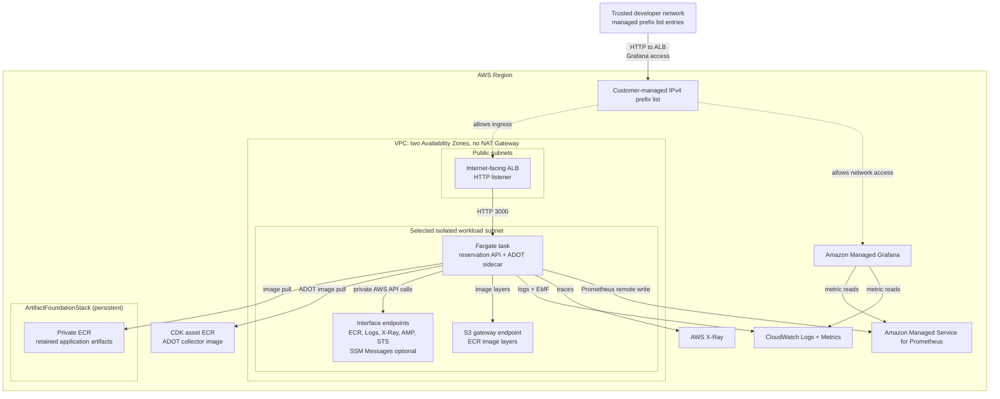

# AWS Resource Topology

Historical single-stack topology. Current ownership and the eight-container
request/audit path are documented in
[Audit and Observability](audit-and-observability.md).

This page describes the persistent artifact foundation modeled by
`ArtifactFoundationStack` and the disposable resources modeled by
`MovieReservationWorkloadStack`. The two CDK applications are intentionally
independent because their teardown boundaries differ.

## Runtime View



## Resource Responsibilities

### Lifecycle ownership

| Resource group | Owner | Lifecycle |
| --- | --- | --- |
| Application artifact ECR repository | `ArtifactFoundationStack` | Persistent between demos; final cleanup only through the guarded workflow |
| VPC, ALB, ECS, observability, workload log groups, and Grafana role | `MovieReservationWorkloadStack` | Disposable; destroy promptly after a demo |
| CDK asset bucket and ECR repository | `CDKToolkit` | Shared account/Region deployment prerequisite; preserved |
| Ingress prefix list and account identity/governance | External account prerequisites | Preserved; separate operating procedures |

### Network

The workload stack creates a small VPC with public subnets for the ALB and
isolated private subnets for Fargate workloads. There is no NAT Gateway. Private
AWS API access is provided through VPC endpoints so the task can pull images,
write logs, export traces, and remote-write metrics without general outbound
internet access.

### Ingress

The ALB and Managed Grafana access are restricted by a customer-managed IPv4
prefix list supplied as CDK context:

```bash
-c allowedIngressPrefixListId=pl-0123456789abcdef0
```

Operators update trusted `/32` entries in the prefix list without redeploying
the stack. The stack validates only the ID shape offline. Before deployment, the
operator runbook verifies the external list's target-account ownership, Region,
IPv4 family, state, bounded capacity, and reviewed entries through authenticated
AWS APIs.

Using one prefix list for both surfaces deliberately couples their network
reachability. That is acceptable during the demo phase because the same trusted
developers use the reservation API and Grafana, while Grafana still requires
IAM Identity Center authentication and authorization. Reconsider separate ALB
and Grafana prefix lists when their audiences, operators, security requirements,
or lifecycles diverge.

### Compute

The deadline demo workload runs as one ECS/Fargate service with one task. The
task contains the web, agent, two MCP, two API, and nonessential ADOT containers.
Only web TCP `8088` is registered with the ALB; task-local calls use loopback.
This couples lifecycle, scaling, and rollback and is not the long-term
independently deployable topology.

### Artifacts

`ArtifactFoundationStack` creates one private ECR repository for each of the
six application components independently of the workload. The private
environments workflow admits approved immutable candidates into those
destinations. The workload imports every selection by digest:

```text
<account>.dkr.ecr.<region>.amazonaws.com/<component-repository>@sha256:<digest>
```

Mutable tags are not deployable selectors. Tags may appear only as human
provenance in application or environment repositories.

The foundation outputs repository name, URI, and ARN for runtime discovery; the
concrete account-local values are not committed or connected to the workload by
a CloudFormation cross-stack reference.

The ADOT collector image is a repository-owned CDK Docker asset because it is
part of infrastructure, not application source. CDK publishes it to the
separate `CDKToolkit` asset repository during workload deployment.

### Observability

The stack provisions short-retention CloudWatch log groups, X-Ray trace export,
AMP metrics, Managed Grafana, and a repository dashboard artifact. This supports
runtime debugging and demo observability.

DORA delivery telemetry is intentionally separate. Deployment frequency, lead
time, failure rate, recovery time, and rework rate should come from deployment
events owned by the environment-control workflow, not from application request
telemetry.

## Design Constraints

- Keep public CI offline and deterministic.
- Keep application source outside this repo.
- Keep teardown explicit and cheap: routine teardown removes the workload, while
  guarded final cleanup removes the persistent artifact foundation.
- Do not add shared-account promotion automation until the environment manifest
  and release workflow are intentionally designed.
