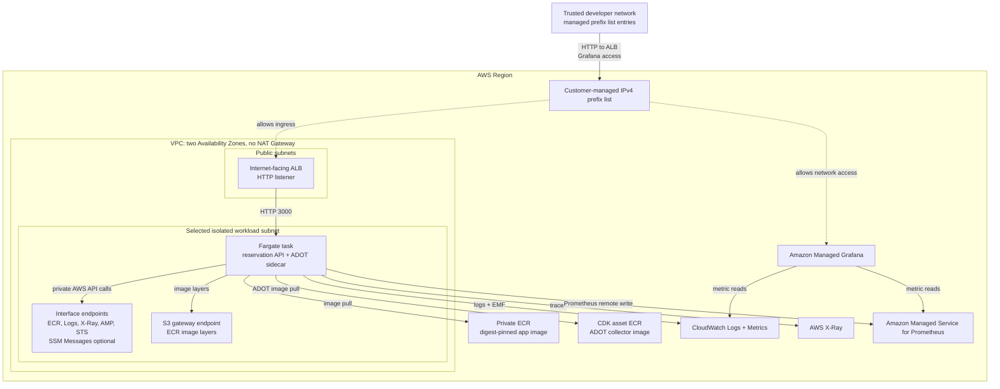

# AWS Resource Topology

This page describes the AWS resources modeled by `GoldenPathDemoStack` in
`lib/infra-stack.ts`. It is adapted from the original golden-path architecture
docs and updated for the standalone infrastructure repository.

## Runtime View



## Resource Responsibilities

### Network

The stack creates a small VPC with public subnets for the ALB and isolated
private subnets for Fargate workloads. There is no NAT Gateway. Private AWS API
access is provided through VPC endpoints so the task can pull images, write
logs, export traces, and remote-write metrics without general outbound internet
access.

### Ingress

The ALB and Managed Grafana access are restricted by a customer-managed IPv4
prefix list supplied as CDK context:

```bash
-c allowedIngressPrefixListId=pl-0123456789abcdef0
```

Operators update trusted `/32` entries in the prefix list without redeploying
the stack. The stack validates only the ID shape offline. Before deployment, the
operator runbook verifies the external list's target-account ownership, Region,
IPv4 family, state, bounded capacity, and reviewed entries through authenticated
AWS APIs.

Using one prefix list for both surfaces deliberately couples their network
reachability. That is acceptable during the demo phase because the same trusted
developers use the reservation API and Grafana, while Grafana still requires
IAM Identity Center authentication and authorization. Reconsider separate ALB
and Grafana prefix lists when their audiences, operators, security requirements,
or lifecycles diverge.

### Compute

The first demo workload runs as one ECS/Fargate service with one task. The task
contains:

- an essential reservation API container on TCP `3000`;
- a nonessential ADOT collector sidecar for traces and metrics.

Future web, agent, recommendation, and MCP services should be added as separate
implementation slices after artifact contracts and environment manifest
selection are ready.

### Artifacts

The reservation API image is imported from private ECR by immutable digest:

```text
<account>.dkr.ecr.<region>.amazonaws.com/movie-reservation-service@sha256:<digest>
```

Mutable tags are not deployable selectors. Tags may appear only as human
provenance in application or environment repositories.

The ADOT collector image is a repository-owned CDK Docker asset because it is
part of infrastructure, not application source.

### Observability

The stack provisions short-retention CloudWatch log groups, X-Ray trace export,
AMP metrics, Managed Grafana, and a repository dashboard artifact. This supports
runtime debugging and demo observability.

DORA delivery telemetry is intentionally separate. Deployment frequency, lead
time, failure rate, recovery time, and rework rate should come from deployment
events owned by the environment-control workflow, not from application request
telemetry.

## Design Constraints

- Keep public CI offline and deterministic.
- Keep application source outside this repo.
- Keep teardown explicit and cheap.
- Do not add shared-account promotion automation until the environment manifest
  and release workflow are intentionally designed.
