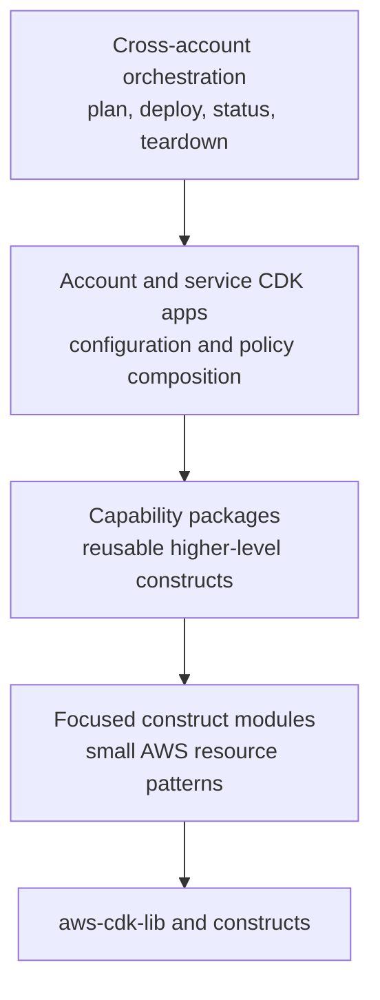
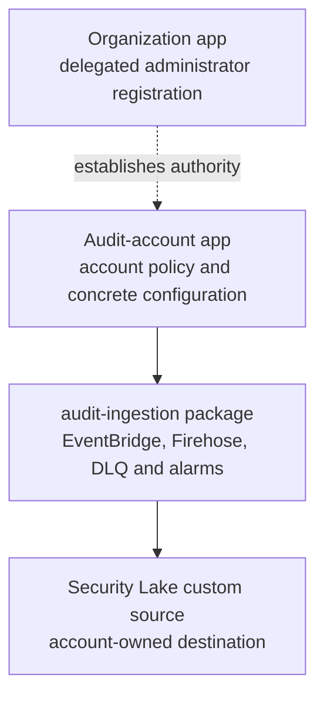
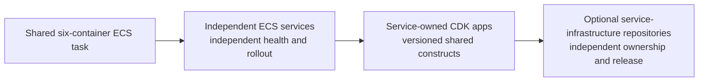

# Modular CDK repository strategy

Status: agreed architectural direction. This note defines dependency and
extraction boundaries; issue-level implementation plans still decide exact
files, migrations and release slices.

## Decision

Keep `movie-platform-infra` as one repository while introducing independently
buildable CDK applications and reusable construct packages. Extract repositories
only after a capability has a stable interface and a credible independent
consumer, owner or release lifecycle.

Use the Security Lake ingestion capability as the first new extraction-ready
package. Migrate existing infrastructure incrementally when real work touches
it. Do not reorganize the entire repository or split the shared ECS task as a
prerequisite for the Security Lake release.

The desired longer-term state is:

- reusable, versioned platform IaC building blocks;
- separate account-level infrastructure applications;
- independently deployable service infrastructure as services leave the shared
  ECS task; and
- repository extraction that follows proven ownership and release boundaries.

## Architecture layers



Dependencies point downward. A lower layer must not import an account app,
read its configuration files or assume its deployment workflow.

| Layer | Owns | Does not own |
| --- | --- | --- |
| Construct module | One focused AWS resource pattern | Account selection, organization policy or deployment |
| Capability package | A cohesive reusable platform capability | Concrete environment identities or orchestration |
| CDK app and stacks | Account-specific policy, configuration and composition | Reusable implementation copied into other apps |
| Orchestration | Ordered multi-account invocation and evidence | Infrastructure policy hidden in shell or workflow YAML |
| Environment control | Desired release composition and promotion | CDK construct implementation or live cloud state |

## Initial repository shape

Adopt the shape progressively; directories appear only when their first real
capability is implemented.

```text
movie-platform-infra/
├── apps/
│   ├── organization/
│   ├── audit-account/
│   ├── workload-account/
│   ├── observability-account/
│   └── artifact-foundation/
├── packages/
│   ├── audit-ingestion/
│   ├── github-oidc/
│   ├── artifact-foundation/
│   └── ecs-service/
├── orchestration/
├── test/
└── package.json
```

The initial migration creates only the directories and packages required for
Security Lake. Existing entry points keep working until their capabilities are
migrated in separate reviewable changes.

## Package rules

Every reusable CDK package must:

- have its own `package.json`, TypeScript configuration, explicit exports,
  build and tests;
- build and test without importing source outside its package directory;
- accept typed properties instead of reading CDK context, environment variables
  or repository files;
- avoid embedded account IDs, Regions, physical ARNs and environment names;
- expose the minimum typed resources or attributes required for composition;
- use composition instead of a universal base stack or inheritance hierarchy;
- include focused synthesized-template assertions for its security and lifecycle
  contract;
- include a small standalone consumer app or packed-package test before external
  publication; and
- declare and test its supported `aws-cdk-lib` and `constructs` compatibility.

Package names describe capabilities such as `audit-ingestion`; avoid a generic
`platform-utils` or `common-constructs` package.

## App and stack rules

CDK apps are composition roots. They parse external configuration, choose the
target account and Region, instantiate stacks and supply policy decisions to
construct packages.

Create a stack boundary when resources differ materially by:

- AWS account or Region;
- owner or deployment authority;
- retention and teardown lifecycle;
- change frequency; or
- permissions required to deploy them.

Do not create one stack per AWS resource. Excessively small stacks replace code
coupling with output wiring, deployment ordering and replacement constraints.

Cross-account applications exchange explicit, reviewed identifiers. Do not use
CloudFormation exports as an accidental cross-account service registry.

## First reference capability: audit ingestion

The Security Lake work establishes the packaging pattern without refactoring
unrelated infrastructure.



The reusable package may own the EventBridge rule, target DLQ, Firehose delivery,
format-conversion wiring and delivery alarms. It must not designate an
Organizations administrator, choose the audit account, read service source code
or decide irreversible evidence retention.

The audit-account app owns those concrete choices and composes the package with
the Security Lake custom source.

## Service infrastructure direction

The current six applications share one ECS task and therefore one deployment
lifecycle. Repository boundaries cannot make those services independently
deployable while the runtime topology remains shared.

The desired progression is:



Once a service has its own runtime and deployment lifecycle, its infrastructure
can live beside the service, in a dedicated infrastructure repository, or in an
independently deployed workload application. The deciding factors are ownership,
review authority and release cadence. In every case, consume versioned platform
constructs rather than copying network, ECS, IAM and alarm definitions.

Splitting the ECS task is a separate program of work. It is not part of the
Security Lake ingestion release.

## Incremental refactor sequence

1. **Record boundaries**
   - Keep this architecture note and the Security Lake option decision current.
   - Map existing stacks to account, owner and teardown lifecycles before moving
     files.

2. **Introduce the minimum workspace structure**
   - Add npm workspace support for the first `apps/` and `packages/` members.
   - Preserve existing commands or provide compatibility wrappers during the
     transition.

3. **Create the audit-ingestion package**
   - Implement the new Security Lake ingestion path behind typed construct
     properties.
   - Add package-local synthesis tests and a standalone consumer test.

4. **Create the audit-account app**
   - Compose the central event bus, Security Lake source and ingestion package
     for the dedicated audit account.
   - Keep organization delegation in a distinct management-account boundary.

5. **Add lifecycle orchestration**
   - Provide explicit plan, deploy, status, demo-stop and full-teardown flows.
   - Assume narrow roles per account and record which retained data remains.

6. **Migrate existing capabilities when touched**
   - Extract GitHub OIDC, artifact foundation, observability and workload
     patterns through their own issues and PRs.
   - Preserve behavior while moving one boundary at a time.

7. **Separate service runtimes**
   - Move services out of the shared ECS task through independently planned
     deployment slices.
   - Introduce service-owned apps only when deployment independence exists.

8. **Publish proven packages**
   - Publish a construct package when a second repository is ready to consume
     it or independent patching is required.
   - Add semantic versioning, compatibility policy, package provenance and a
     consumer migration procedure.

9. **Extract repositories**
   - Move cohesive packages or apps without changing their public interfaces.
   - Keep thin repository-specific composition roots rather than copying the
     implementation.

## Historical implementation preservation

Keep the custom S3/Athena audit lake as a tested `legacy-audit-demo` app while
the Security Lake replacement is being built and verified. Do not maintain two
active audit architectures indefinitely.

Before removing the legacy app from the default branch:

1. Create an immutable annotated Git tag at its final working revision.
2. Add a concise historical architecture page containing its diagram, resource
   inventory, deployment evidence, useful design lessons and known guarantee
   gaps.
3. Link that page to the exact tag and commit so a reader can inspect or restore
   the implementation without searching commit history.
4. Move useful implementation plans into delivered history and update current
   architecture pages so they cannot be mistaken for deployed truth.
5. Remove the legacy app and its obsolete dependencies from the default branch
   in a dedicated PR after Security Lake acceptance and rollback criteria pass.

Prefer an immutable tag and discoverable historical page over a permanent
archive branch. A long-lived branch silently rots, while retaining unused code
on the default branch keeps dependency, CI and onboarding costs alive.

## Reviewable change boundaries

Do not combine these into one refactor pull request. A practical sequence is:

1. Architecture and workspace contract.
2. Empty independently buildable package/app skeleton with consumer proof.
3. Security Lake custom-source foundation.
4. EventBridge and Firehose ingestion package.
5. Audit-account composition and offline synthesis tests.
6. Multi-account orchestration and teardown.
7. TypeScript SDK publication.
8. Reservation-service integration.
9. Live deployment and end-to-end evidence, only with explicit authorization.

Exact PR ordering may change after the full audit-demo design interview. Each
PR must leave the repository buildable and must have one primary review claim.

## Extraction criteria

Extract a package or app only when at least one condition is true:

- a second repository is ready to consume it;
- it has an independent owner or deployment authority;
- it needs an independent security patch or release cadence;
- repository permissions must differ; or
- its distribution requirements no longer fit this repository.

Before extraction, require a stable public API, package-level tests, standalone
consumer proof, semantic versioning, publishing ownership, compatibility policy
and a migration plan. Directory separation alone does not prove reusability.

## Non-goals for the Security Lake release

- Refactor every existing CDK stack.
- Publish speculative construct packages with no external consumer.
- Split all six applications into independent ECS services.
- Create one infrastructure repository per service before their deployments are
  independent.
- Move environment selection or promotion policy into CDK constructs.
