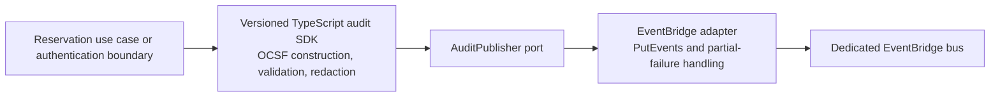
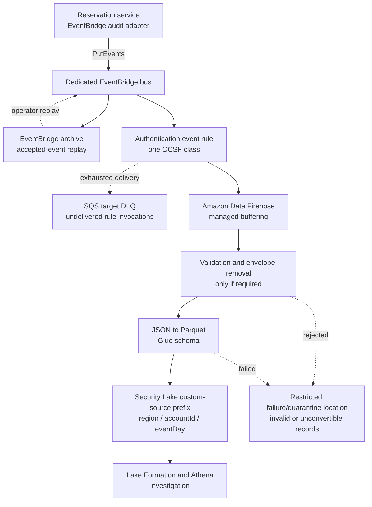
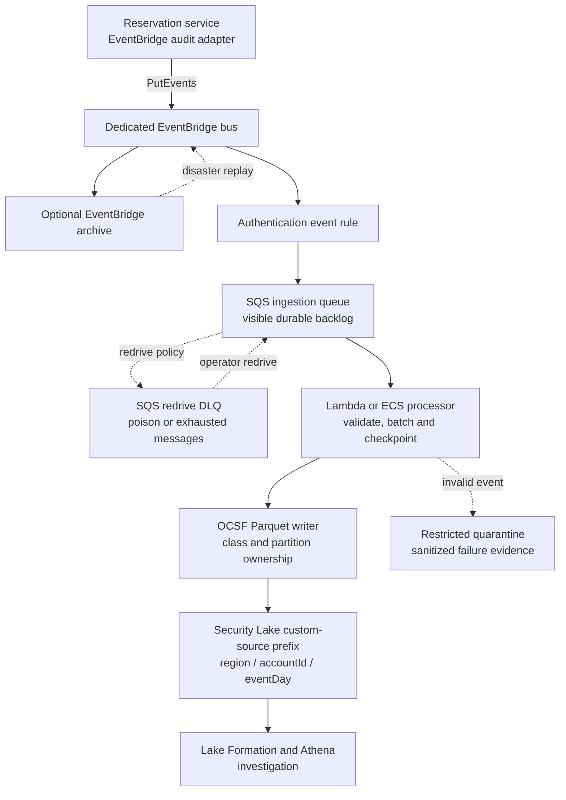

# Security Lake custom-source ingestion options

Status: discussion record. Option A is preferred for the first release; this is
not an implementation plan or authorization to deploy AWS resources.

## Scope and decision

The new demo must deliver reservation-service audit events to **Amazon Security
Lake** as a custom source. The existing custom S3/Athena audit lake is useful
prior art, but it is not a destination option for this release.

The application-facing design is the same for both ingestion options:



The SDK owns event meaning and safe construction. The EventBridge adapter owns
AWS transport details. Neither Firehose, SQS, Parquet nor Security Lake belongs
in the application-facing SDK contract.

Security Lake custom sources do not accept individual JSON events through an
ingestion API. A downstream component must produce OCSF-compatible Parquet,
separate event classes, and write the required Region/account/day partitions to
the custom-source S3 prefix.

For the first release, use **Option A: EventBridge to Firehose to Security
Lake**. It minimizes code and operational ownership while retaining managed
retry, batching, format conversion and delivery. Keep Option B as the fallback
when an inspectable multi-day backlog, targeted redrive or more complex
processing becomes a demonstrated requirement.

## Option A: EventBridge to Firehose



EventBridge supplies acceptance and routing. Firehose is the component that
batches, converts and writes events to Security Lake. The EventBridge archive
is the recovery source for an outage longer than Firehose's Direct Put retention
window. The rule-target DLQ captures failures between EventBridge and Firehose;
it is not on the normal path.

The EventBridge rule should forward the OCSF payload rather than preserve the
outer EventBridge envelope in the Security Lake record. A transformation stage
is justified only for runtime validation, safe envelope removal, required
partition derivation or quarantine. Event semantics remain owned by the SDK.

### Reliability and durability

- Both EventBridge and Firehose provide managed retry, but neither gives the
  application proof that the final Security Lake object exists.
- EventBridge `PutEvents` can partially succeed. The adapter must inspect every
  result entry and retry only retryable failed entries.
- A successful publish to a missing event bus can return HTTP 200 without a
  failed entry. Provisioning tests and delivery alarms are part of the safety
  boundary.
- EventBridge retries failed target delivery and can send exhausted deliveries
  to the target DLQ.
- Firehose Direct Put retains undelivered records for at most 24 hours. An
  EventBridge archive provides longer operator-controlled replay when configured
  with suitable retention.
- Delivery is at least once. `metadata.uid` remains stable across retries and
  replay so duplicates can be recognized.
- This path is not atomic with a reservation database mutation. A future
  authoritative reservation audit trail still requires a transactional outbox
  or another durable producer-side journal.

### Throughput and operations

Firehose manages batching and Parquet object creation. Its default Direct Put
quota outside the three higher-default Regions is currently 100,000 records,
1,000 requests and 1 MiB per second per stream, with automatic throughput
increases and quota-increase support. The byte quota is the likely first limit
for OCSF events, but expected demo traffic is far below it.

Operationally, this option needs alarms for EventBridge failed invocations and
DLQ activity, Firehose throttling and delivery freshness, transformation or
format-conversion failures, and the absence of expected Security Lake objects.
The Firehose buffer is managed but not directly inspectable as a queue.

### Cost shape

```text
EventBridge custom-event ingestion
+ optional EventBridge archive storage and replay
+ Firehose ingestion, billed with per-record 5 KiB rounding
+ Firehose Parquet conversion
+ optional transformation and dynamic partitioning
+ common Security Lake, S3, Glue and Athena costs
```

This option may have a higher AWS service charge than a small custom processor,
but it has much lower implementation and maintenance cost. That ownership trade
is the main reason to prefer it for a small team.

## Option B: EventBridge to SQS to a custom processor



SQS is only the durable backlog. The Lambda or ECS processor must still own
validation, batch assembly, Parquet generation, Security Lake partitions,
checkpointing and successful-message deletion.

### Reliability and durability

- Messages remain in SQS until the processor deletes them after successful S3
  publication. Retention is configurable from one minute through 14 days.
- Queue depth and oldest-message age make backpressure and stalled processing
  visible.
- Operators can redrive selected failed messages without replaying a whole time
  range through the EventBridge bus.
- SQS Standard and processor retries are at least once. A crash after writing a
  Parquet object but before deleting its messages can publish duplicates.
- Correct batching complicates acknowledgment: a processor must durably track
  which input messages contributed to which output object.
- A poison event must not prevent valid events in the same batch from making
  progress.

This option offers the stronger recovery boundary, but only if the custom
processor and its checkpoints are correct. The additional code creates failure
modes that Firehose otherwise owns.

### Throughput and operations

SQS Standard can absorb a very large burst while processors drain it at a
controlled rate. Consumer concurrency can scale independently from producers.
That flexibility must be constrained because many concurrent processors can
create small Parquet objects and degrade Security Lake query behavior.

The team owns concurrency limits, batching windows, partial-batch failures,
idempotency, schema upgrades, checkpoint recovery, late events, quarantine and
deployments of the processor runtime.

### Cost shape

```text
EventBridge custom-event ingestion
+ optional EventBridge archive storage and replay
+ SQS send, receive, delete and redrive requests
+ Lambda request/duration or continuously running ECS capacity
+ Parquet library compute and S3 PUT requests
+ common Security Lake, S3, Glue and Athena costs
```

At demo volume, direct AWS charges for either option should be small. Option B
can avoid Firehose ingestion and conversion charges, but the custom processor's
engineering and operational cost dominates the comparison for a small team.

## Side-by-side comparison

| Concern | Option A: EventBridge to Firehose | Option B: EventBridge to SQS and processor |
| --- | --- | --- |
| Normal-path components | EventBridge, Firehose | EventBridge, SQS, Lambda or ECS |
| Durable downstream buffer | Managed Firehose buffer, at most 24 hours for Direct Put | Visible SQS messages, at most 14 days |
| Longer replay | EventBridge archive and target DLQ | SQS/DLQ redrive; optional EventBridge archive |
| Backpressure visibility | Metrics, no inspectable record backlog | Queue depth and oldest-message age |
| Batching and Parquet | Managed by Firehose | Implemented and operated by the team |
| Invalid-event handling | Firehose transformation/conversion failure path | Custom quarantine and partial-batch policy |
| Burst absorption | High managed capacity with per-stream quotas | Very high queue absorption; consumer-controlled drain rate |
| Duplicate handling | Required | Required |
| Ordering | No end-to-end guarantee | Standard SQS has no ordering; FIFO adds constraints and does not remove batching work |
| Operational control | Lower | Higher |
| Application coupling | Same EventBridge adapter | Same EventBridge adapter |
| Infrastructure cost | Firehose ingestion and optional features | SQS requests plus processor compute |
| Team ownership | Lower | Higher |
| First-release decision | **Preferred** | Retain as fallback |

## Conditions that would justify Option B

Reconsider the custom processor when evidence shows that one or more of these
requirements matters more than minimizing ownership:

- outages must be absorbed for substantially longer than Firehose's 24-hour
  Direct Put window without relying on archive replay;
- operators need to inspect and selectively redrive the normal-path backlog;
- validation, enrichment or OCSF mapping cannot fit safely in Firehose's
  transformation and format-conversion model;
- multiple downstream writes require a custom checkpoint;
- measured bursts exceed the practical Firehose quota or scaling behavior; or
- poison-event isolation requires finer control than the Firehose failure path.

## Checks required before implementation planning

The preferred shape still needs a focused technical spike before its CDK plan
is finalized:

1. Prove that Firehose can assume the correct delivery role and write only to
   the prefix assigned to the Security Lake custom source.
2. Prove that the constrained OCSF 1.3 Authentication schema converts through
   the selected Glue schema into Parquet accepted and queryable by Security
   Lake.
3. Prove the exact `region`, `accountId` and UTC `eventDay` partition layout,
   time ordering, compression and object cadence.
4. Keep transformation failures and quarantined input outside the valid custom
   source dataset. Treat EventBridge archives, DLQs and Firehose conversion-error
   output as potentially sensitive raw input: encrypt them, restrict access, set
   bounded retention, and expose only sanitized operational summaries. Firehose
   conversion errors can include the original record, so quarantine is not a
   sanitization boundary.
5. Exercise EventBridge partial failure, missing-rule detection, rule-target
   failure, Firehose conversion failure and archive replay while preserving the
   original event ID.
6. Measure event-to-query delay and reconcile produced, EventBridge-accepted,
   Firehose-accepted, quarantined and Security-Lake-queryable counts.

These checks decide whether Firehose is genuinely sufficient. Failure of the
spike is evidence for Option B; it is not a reason to hide custom processing
inside the service SDK.

## References

- [Security Lake custom-source requirements](https://docs.aws.amazon.com/security-lake/latest/userguide/custom-sources.html)
- [EventBridge `PutEvents` failure behavior](https://docs.aws.amazon.com/eventbridge/latest/userguide/eb-putevents.html)
- [EventBridge target retries and DLQs](https://docs.aws.amazon.com/eventbridge/latest/userguide/eb-rule-dlq.html)
- [EventBridge archive replay](https://docs.aws.amazon.com/eventbridge/latest/userguide/eb-replay-archived-event.html)
- [Firehose format conversion](https://docs.aws.amazon.com/firehose/latest/dev/record-format-conversion.html)
- [Firehose S3 delivery retry behavior](https://docs.aws.amazon.com/firehose/latest/dev/retry.html)
- [Firehose Direct Put quotas](https://docs.aws.amazon.com/firehose/latest/dev/limits.html)
- [SQS retention and throughput](https://docs.aws.amazon.com/AWSSimpleQueueService/latest/SQSDeveloperGuide/quotas-messages.html)
- [EventBridge pricing](https://aws.amazon.com/eventbridge/pricing/)
- [Firehose pricing](https://aws.amazon.com/firehose/pricing/)
- [SQS pricing](https://aws.amazon.com/sqs/pricing/)
- Local Programming KB: `Authoritative Audit Logging on AWS`,
  `Transactional Audit Outbox`, and
  `Prefer Kinesis and Object-Locked S3 for AWS Audit Logs`
