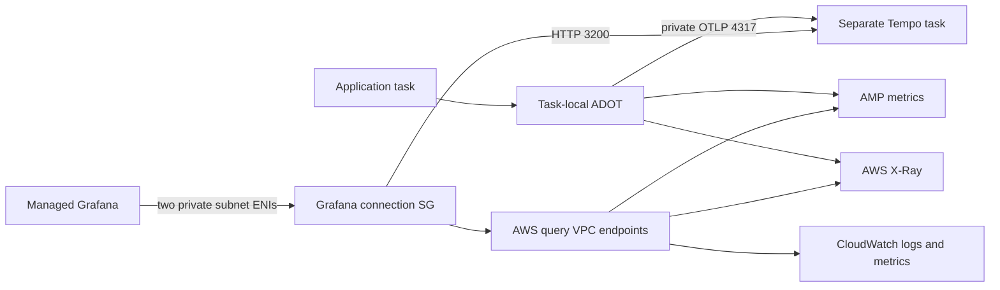

# Private Tempo rehearsal operations

Related: infra #54, [alert/dashboard slice](https://github.com/movie-reservation-platform-lab/movie-platform-infra/issues/53),
[environments lifecycle](https://github.com/movie-reservation-platform-lab/movie-platform-environments/issues/112),
[coordination](https://github.com/movie-reservation-platform-lab/.github/issues/15).

## What this adds

Keep Managed Grafana and AMP. Tempo is a **separate private ECS task**, not a
replacement for X-Ray. ADOT sends a second copy of traces over private OTLP/gRPC;
the base X-Ray pipeline and metrics remain enabled. Audit routing is unchanged.

Tempo has no authentication proxy or TLS in this disposable demo. Security groups
allow ingestion only from the application task, and query only from the Grafana
connection. Never publish these ports or widen ingress to an internet CIDR.
This does not grant candidate AWS/Grafana access; named access is separate.

## Limits and cost

One 0.5-vCPU/1-GiB Fargate task; 24-hour local retention on ephemeral task storage.
**Replacing or stopping Tempo loses all its traces.** X-Ray remains a fallback.
Deployments stop the old task before starting the replacement (0% minimum / 100%
maximum) to avoid two independent ingesters sharing one DNS name. Expect a gap;
ADOT queue128/retry15s bounds failure impact but does not guarantee delivery.
This is not a durable audit store, highly available backend or production design.

Additional charged resources: one task, three interface endpoints (CloudWatch
monitoring, EC2 API, AMP control-plane; one endpoint AZ each), Cloud Map/DNS and
logs. Existing endpoints remain in one AZ; both AMG subnets can reach them, but
that is not multi-AZ availability. No NAT or public Tempo load balancer is added.

## Before deployment

1. Confirm AWS account/region/SSO session and the target stack. Keep selected
   application image digests/admission evidence unchanged.
2. Deploy the **output-only ObservabilityStack change first**, after reviewing its
   diff. New export `MoviePlatformAwsDemo:GrafanaDataAccessRoleArn` scopes the STS
   endpoint's AssumeRole permission. No reverse workload import is introduced.
3. Synthesize a fresh workload assembly using existing release arguments and
   `npm run demo:workload -- ... --enable-tempo`. Direct CDK uses
   `-c enableTempo=true`. Never overwrite the saved previous assembly.
4. Diff and approve the workload change separately. CDK builds the pinned Tempo
   asset locally and publishes it to bootstrap ECR; isolated tasks do not pull
   Docker Hub. The build host needs registry access and Docker.
5. Deploy, then verify the application service and `aws-demo-tempo` service are
   stable and the Tempo container health is HEALTHY. A successful CloudFormation
   operation alone is not proof that traces can be queried.

## Attach existing AMG deliberately

The workload outputs these concrete values:

| Output | Meaning |
| --- | --- |
| `TempoQueryUrl` | `http://tempo.aws-demo.internal:3200` |
| `TempoOtlpEndpoint` | `tempo.aws-demo.internal:4317` |
| `GrafanaVpcId` | Disposable workload VPC |
| `GrafanaVpcSubnetIds` | CSV of **two** private subnets in different AZs |
| `GrafanaVpcSecurityGroupId` | Connection SG; no inbound rules |

AMG VPC attachment is an explicit post-deploy operator action and creates
acknowledged drift from the foundation template. Do not re-deploy that template
while attached without reviewing the proposed attachment change. Do not add
workload imports to ObservabilityStack; that would make a dependency cycle.

1. Save `aws grafana describe-workspace --workspace-id "$GRAFANA_WORKSPACE_ID"`
   to the local execution journal **before** any update. Record whether the
   previous workspace had a `vpcConfiguration`; save it verbatim when present.
2. Inspect both exported subnets (`aws ec2 describe-subnets`): correct VPC,
   different AZs, each at least **15 available IPv4 addresses**. Inspect endpoint
   availability and security-group rules. Private DNS is enabled in the VPC and
   Cloud Map resolves `tempo.aws-demo.internal` inside it.
3. With explicit operator approval, use AMG console **Network access settings →
   Outbound VPC connection** with those two subnets and the exported connection
   SG. Equivalent API: `aws grafana update-workspace --workspace-id ID
   --vpc-configuration 'subnetIds=subnet-A,subnet-B,securityGroupIds=sg-ID'`.
   The example IDs are placeholders; do not paste them unchanged.
4. Wait for workspace ACTIVE. Preserve before/after state and timestamps in the
   journal. Do not claim the AWS data sources still work before testing them.

No internet egress is provided. External webhook delivery is intentionally
deferred. Use regional AWS endpoints, including regional STS, in data-source
settings. The STS endpoint permits AssumeRole only for the existing Grafana data
role; arbitrary custom data-source roles require separate review. Existing role
IAM remains authoritative; endpoint policies do not grant new role permissions.

## Configure and prove Grafana

Create a Tempo data source named `demo-tempo` using `TempoQueryUrl` and
server/proxy access. Record its actual UID from Grafana and pass that to the
service dashboard renderer; a UI-created source can receive an autogenerated
UID. `demo-tempo` is only a suggested UID for explicitly approved provisioning,
not an assumption about the existing workspace. Ensure the installed AMG version
supports its Tempo plugin. Use **Save & test** and an actual trace query; a laptop cannot
reach this private hostname and is not the right probe.

- Trigger one real browser/agent request and locate the same 32-hex trace ID in
  Tempo. X-Ray's `1-xxxxxxxx-xxxxxxxxxxxxxxxxxxxxxxxx` notation is not Tempo's ID.
- Verify native trace search and span inspection. Do not claim spans for
  components without instrumentation or automatic CloudWatch log correlation.
- Immediately exercise existing AMP PromQL, CloudWatch metric query, CloudWatch
  Logs Insights and X-Ray trace query from AMG. All now route through the VPC.
- Use explicitly configured workspace URLs; dynamic AMP workspace discovery may
  need additional IAM permissions and is not necessary for existing data sources.
- Capture synthetic evidence only. Never put credentials or real trace payloads
  containing personal data in public issues or screenshots.

If any existing data source regresses, restore the prior AMG connection promptly.
Native Tempo is not delivered until both ingestion and AMG queries pass live.

## Restore/detach BEFORE workload teardown

1. Restore the exact saved prior `vpcConfiguration` with `update-workspace`, or,
   if it was absent, explicitly remove it with
   `aws grafana update-workspace --workspace-id "$GRAFANA_WORKSPACE_ID"
   --remove-vpc-configuration`.
2. Wait for workspace ACTIVE and re-read configuration. Prove it references none
   of the disposable workload subnets/security groups. Verify the old data-source
   path works again. Allow AMG-managed ENIs to disappear; do not delete them by
   hand via EC2.
3. Only then disable Tempo/redeploy or use the normal workload teardown workflow.
   Environments #112 adds a fail-closed guard for attached AMG; do not bypass it.
   Retain observability/audit/artifact foundations as usual.

## Offline checks versus live acceptance

`npm run build`, `npm run test:cdk:workload`, `npm run test:tooling` and
`npm run validate:tempo-image` exercise synthesis and a real local trace sent
through the pinned ADOT overlay to pinned Tempo, with container networking
isolated from AWS. They do not prove AWS deployment, AMG version/plugin support,
DNS propagation, access or live data-source reachability.

References: [AWS AMG VPC connectivity](https://docs.aws.amazon.com/grafana/latest/userguide/AMG-configure-vpc.html),
[versioned official Tempo example](https://github.com/grafana/tempo/tree/v2.10.8/example/docker-compose/local).
