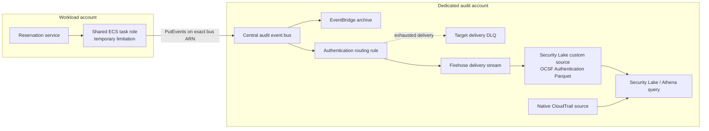
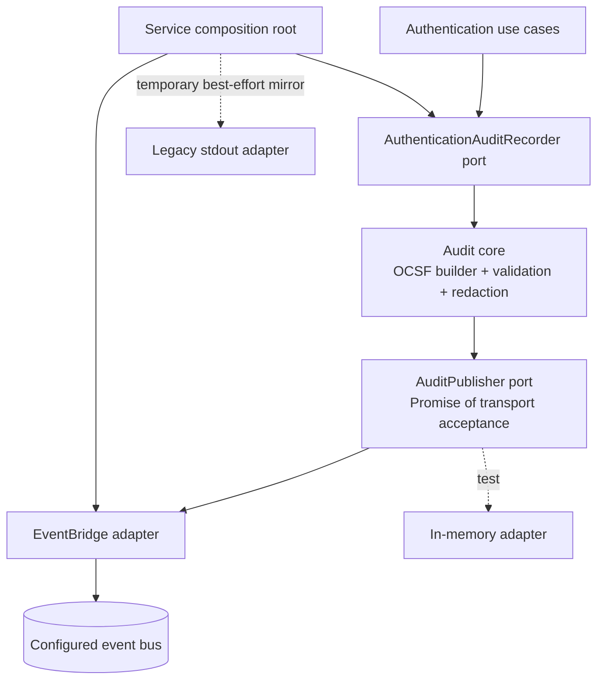
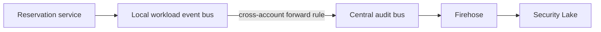

# Implementation Plan: EventBridge to Security Lake Audit Demo

## 1. Summary

Build a reviewable audit path from the TypeScript reservation service to a
dedicated AWS audit account:

```text
reservation service -> central EventBridge bus -> Firehose -> Security Lake custom source
```

The service will consume an exact-pinned, extraction-ready TypeScript audit SDK.
The SDK will own the constrained OCSF Authentication contract and a publisher
port; an EventBridge adapter will implement the first transport. The audit
account will own routing, buffering, OCSF-compatible Parquet delivery, retention,
query access, alarms, and native CloudTrail ingestion.

This is a representative demo with outcome-aware delivery to EventBridge. It is
not an authoritative, transactionally coupled record of reservation commits.
The managed EventBridge-to-Firehose design is preferred because it has less code
and operational ownership than an SQS-backed custom processor. The boundaries
must still permit that processor, local workload buses, additional event classes,
additional language SDKs, and separate repositories later.

This is a cross-cutting infrastructure, contract, security, and repository
refactor. Implementation is deliberately split into thirteen repository-local
pull requests with one explicit live release checkpoint. The original ten-step
shape grew after review exposed private-network, cross-repository, and legacy
FireLens dependencies that would otherwise have been hidden inside large PRs.

## 2. Goals

- Show a TypeScript service consuming and exact-pinning a reusable audit SDK.
- Emit constrained OCSF 1.3 Authentication events through an abstract publisher.
- Require bounded EventBridge acceptance before successful authentication is
  returned, while preserving an already-rejected authentication result.
- Ingest custom audit events into Amazon Security Lake through a managed path.
- Enable native CloudTrail management events in Security Lake for the demo.
- Put Security Lake and central ingestion resources in a dedicated audit account.
- Emit low-cardinality service and pipeline metrics with actionable alarms.
- Verify the live path with one bounded, machine-readable smoke test.
- Establish npm workspace, CDK package, and app boundaries that can be extracted
  without redesigning their public interfaces.
- Preserve the current custom audit lake as a temporary, testable legacy app and
  later retain its explanation through an immutable tag and historical document.
- Support cheap teardown while retaining the low-cost audit data baseline when
  desired.

## 3. Non-goals

- Transactionally coupling reservation database commits to audit persistence.
- Treating EventBridge acceptance as proof that Security Lake stored the event.
- Supporting every OCSF class or every application language in the first release.
- Building the SQS-backed custom processor now.
- Converting ALB access logs to OCSF HTTP Activity in this release.
- Splitting the existing shared ECS task or its shared task role in this release.
- Publishing packages to a permanent cross-repository registry before a second
  repository is ready to consume them.
- Reorganizing all existing infrastructure at once.
- Automating AWS Organizations account vending in the first release.
- Mutating live AWS resources as part of ordinary pull-request validation.

## 4. Current State

### Reservation service

The reservation service already builds a constrained OCSF 1.3 Authentication
event and redacts credentials. `AuthenticationAuditRecorder` is the application
port, `RequestAuthenticationAuditRecorder` builds correlation fields, and
`AuditEventSink` is the outbound port. `StdoutAuditEventSink` is selected in the
composition root. The current sink is synchronous and describes only a local
handoff:

- `src/application/audit/authentication-audit-event.ts`
- `src/application/audit/ports/authentication-audit-recorder.ts`
- `src/application/audit/ports/audit-event-sink.ts`
- `src/infrastructure/audit/request-authentication-audit-recorder.ts`
- `src/infrastructure/audit/stdout-audit-event-sink.ts`
- `src/di/audit/create-authentication-audit-recorder.ts`
- `test/fixtures/audit/platform-audit-event-v1.schema.json`
- `test/fixtures/audit/platform-audit-contract-v1.json`

The HTTP demo login already fails with a redacted 503 when an otherwise
successful authentication cannot be audited. Existing GraphQL rejection tests
preserve the rejection if audit emission fails. This policy becomes explicit
and is retained when the sink becomes asynchronous.

### Infrastructure

`lib/audit-stack.ts` currently implements a custom audit lake: Firehose DirectPut
to JSONL/Gzip in S3, Glue/Athena resources, CloudTrail delivery, and ALB access
logs. `bin/audit.ts` composes it and `test/audit-foundations.test.ts` asserts its
template. The repository is one npm package without workspace boundaries.

The current workload places six containers behind one ECS task role. Granting
that role `events:PutEvents` therefore grants all six containers the technical
ability to use the central bus. Event source fields help investigation but are
not a cryptographic producer boundary.

The task runs in private isolated subnets with no NAT gateway and no public IP.
It has a Firehose interface endpoint for the legacy audit path but no EventBridge
interface endpoint. The workload also imports the legacy delivery-stream outputs,
runs an essential FireLens router, and routes application logs through it. Both
the new publisher's network path and the old pipeline's removal therefore need
explicit workload-infrastructure changes.

The repository strategy and ingestion comparison are recorded in:

- `docs/architecture/modular-cdk-repository-strategy.md`
- `docs/architecture/security-lake-custom-source-ingestion-options.md`

### AWS constraints

- A Security Lake custom source must write OCSF-compatible Parquet under the
  documented custom-source partition layout. Different OCSF event classes need
  separate sources.
- EventBridge `PutEvents` can partially fail. A successful HTTP response is not
  enough; the adapter must inspect `FailedEntryCount` and every result entry.
- A request to a missing event bus can be accepted by the API without delivering
  an event. Deployment and smoke tests must therefore verify the configured bus.
- EventBridge target delivery has bounded retries and supports a target DLQ.
- Security Lake custom data does not incur Security Lake ingestion charges, but
  S3, EventBridge, Firehose, Glue, Athena, KMS, and log/metric usage still cost.
- Disabling Security Lake does not automatically remove all retained data and
  custom-source resources. Full cleanup needs an explicit order and evidence.

## 5. Requirements and Assumptions

### Confirmed requirements

- Use option A now: EventBridge to Firehose to Security Lake.
- Keep option B, EventBridge to SQS to a custom processor, as a documented
  migration when managed transformation proves insufficient.
- Start with OCSF Authentication only and add event classes later.
- Start with direct service publication to a central audit-account bus.
- Design the service adapter so a future local workload bus can forward to the
  central bus without changing domain or SDK event construction.
- Create a dedicated audit account manually; automate its bootstrap afterward.
- Include native CloudTrail management events and the custom Authentication
  source in the first demo.
- Record ALB-to-OCSF HTTP Activity as backlog work.
- Incubate the SDK in `movie-reservation-service`, exact-pin it, and isolate it
  for later extraction to a dedicated contract/SDK repository.
- Incubate reusable CDK constructs and independently deployable account apps in
  `movie-platform-infra` npm workspaces.
- Move the legacy audit stack into an explicit legacy app before building the
  new audit-account app.
- Keep the shared ECS role temporarily and document its authorization weakness.
- Run a credential-free offline suite in pull requests and a bounded live smoke
  test after deployment.
- Run the old stdout path as a short, best-effort comparison mirror. EventBridge
  remains the required path and controls request success behavior.
- Provide a two-level teardown model: stop expensive demo resources while
  retaining the baseline, or fully remove the account application and data.
- Deliver the work as a small PR train, with no giant cross-repository PR.

### Assumptions

- The AWS Organization can create one audit member account. The organization
  management account designates that member as the Security Lake delegated
  administrator; the management account is not itself the delegated administrator.
- `eu-central-1` remains the initial demo region unless the deployment manifest
  explicitly selects another supported region.
- Audit volume is demo-scale; default EventBridge and Firehose service quotas are
  expected to be ample, but the live smoke records actual latency.
- The custom-source provider role and Glue table mechanics will be proven by a
  narrow CDK spike before the reusable construct API is frozen.
- Audit records contain identifiers and security outcomes but no credentials,
  tokens, cookies, request bodies, raw authorization headers, or resolved secrets.
- Existing infrastructure and service test commands remain authoritative in
  their own repositories.

### Open technical validations

These are implementation spikes rather than unresolved product choices:

1. Confirm the smallest supported IAM relationship among Security Lake, the
   custom-source provider role, Firehose, Glue, S3, KMS, and EventBridge.
2. Confirm whether Firehose JSON-to-Parquet conversion preserves the constrained
   nested OCSF schema without a preprocessing Lambda.
3. Confirm dynamic partitioning can produce the exact Security Lake custom-source
   prefix and event-day semantics with UTC event time.
4. Keep the Firehose conversion schema separate from Security Lake's query/catalog
   table and prove which principal owns each schema throughout source creation.
5. Measure EventBridge acceptance latency and end-to-end query visibility for a
   representative Authentication event.
6. Confirm clean deletion and retained-baseline behavior in a disposable account
   before documenting full teardown as reliable.

If validation 2 or 3 fails, pause the reusable construct work and update this
plan. Do not quietly insert a Lambda transformer; compare that adapter with the
already-documented SQS processor option first.

## 6. Proposed Design

### 6.1 Account and data flow



The central bus owns a resource policy scoped to the expected workload account
and producer role ARN. The task role owns `events:PutEvents` on the exact central
bus ARN. No wildcard bus or action is allowed. The event rule also matches the
bounded source, detail type, and envelope version.

EventBridge archive is short-term operational recovery and replay support. It is
not the authoritative archive. The target DLQ captures events that EventBridge
could not deliver to Firehose after retries. Firehose must expose delivery,
conversion, throttling, and destination errors; failed conversion/output records
go to an explicit quarantine prefix outside the Security Lake source prefix.
The archive, DLQ, and Firehose error output can contain the complete submitted
payload. They are classified as potentially sensitive raw input, encrypted,
access-restricted, lifecycle-bounded, excluded from ordinary query roles, CI
artifacts, and published demo evidence, and represented operationally only by
sanitized counters and identifiers. Producer-side redaction protects the normal
SDK path; the shared task role means it is not an enforced ingestion boundary.

### 6.2 Service and SDK boundaries



The incubating package is physically isolated inside the service repository. A
candidate shape is:

```text
packages/audit-sdk/
  src/core/                 # OCSF types, builders, validation, redaction
  src/ports/                # language-level publisher contract
  src/adapters/eventbridge/ # AWS SDK adapter
  src/testing/              # deterministic fake and fixtures
  contract/                 # JSON Schema and canonical examples
  package.json              # explicit exports and exact dependencies
```

The package exposes narrow subpath exports such as `core`, `eventbridge`, and
`testing`; it must not import service modules. The service may import the package
only through its public exports. A packed-tarball consumer test guards against
accidental workspace-only imports and proves later publication is feasible.

The port returns an asynchronous acceptance result containing the stable audit
event ID, transport ID when present, and a bounded failure classification. The
EventBridge adapter owns AWS request construction, timeout/abort behavior,
partial-result inspection, and safe error mapping. It does not own authentication
policy. The application service decides what to return after an accepted or
failed audit attempt.

For the short comparison window, a service-owned decorator invokes EventBridge
as the required publisher and then writes the same already-built event and event
ID to stdout best-effort. Stdout failures increment a comparison metric but do
not change the required publisher result. The decorator is removed after the
comparison article is complete.

### 6.3 Outcome-aware behavior

| Authentication outcome | EventBridge accepted | API behavior |
|---|---|---|
| Accepted credentials | Yes | Return the existing success response and audit receipt. |
| Accepted credentials | No/timeout | Return the existing redacted audit-unavailable failure. |
| Rejected credentials | Yes | Return the existing rejection and audit receipt. |
| Rejected credentials | No/timeout | Preserve the rejection; record safe operational failure telemetry. |

This policy avoids converting a rejected request into an apparent infrastructure
failure while preventing an authenticated response whose audit event was not
accepted by EventBridge. It still does not guarantee downstream persistence.

### 6.4 Event envelope and contract

The EventBridge envelope is versioned separately from the OCSF detail:

```json
{
  "Source": "movie-platform.reservation-service.audit",
  "DetailType": "ocsf.authentication.v1",
  "EventBusName": "<central-bus-arn>",
  "Resources": ["<service-or-environment-resource-identifier>"],
  "Detail": "<serialized constrained OCSF event>"
}
```

The OCSF event remains `platform-audit/1`, aligned to OCSF 1.3 and constrained to
Authentication. `metadata.uid` is generated once and remains the identity through
the response receipt, EventBridge detail, temporary stdout mirror, Firehose, and
Security Lake query. EventBridge's event ID is transport metadata, not the audit
identity. Contract evolution is additive within v1; breaking changes use a new
side-by-side schema, detail type, source/table, and migration window.

Contract artifacts include:

- a JSON Schema with a stable `$id`;
- canonical accepted and rejected Authentication examples;
- forbidden-sensitive-field tests;
- compatibility tests in the SDK and infrastructure consumer;
- explicit OCSF and platform contract versions;
- an ownership and deprecation policy.

The SDK release produces a versioned contract bundle containing the schema,
canonical examples, manifest, source commit, and SHA-256 checksums. Until a shared
registry is justified, infrastructure uses an explicit update command to download
one release bundle, verify its checksum/provenance, and vendor only the contract
artifacts under a versioned test-fixture directory. Ordinary builds are offline,
never read a sibling checkout, and verify the recorded hash. This is contract
distribution, not a copied SDK implementation. A producer cannot adopt fields
that require a Glue schema change until the pinned infrastructure fixture passes.

### 6.5 CDK boundaries

The infrastructure repository becomes an npm workspace with independently
synthesizable apps and reusable packages:

```text
apps/
  legacy-audit-demo/        # relocated current implementation
  audit-account/            # Security Lake, central ingestion, operations
  workload/                 # existing workload composition, migrated when touched
packages/
  audit-ingestion/          # reusable central bus/rule/archive/DLQ/Firehose source
  test-support/             # only if a second concrete consumer warrants it
```

`packages/audit-ingestion` accepts typed configuration and produces typed outputs
such as the central bus ARN and alarm identifiers. It must not read environment
variables, CDK context, repository config files, or organization state directly.
`apps/audit-account` owns stage/account lookup, Security Lake enablement, retention,
KMS choices, native CloudTrail source, and construct composition. Cross-account
workload permissions are explicit app-level wiring around the reusable package.

Package tests synthesize a minimal fixture stack. App tests assert composition and
account-specific policy. An app may depend on packages; packages must not depend
on apps or import sibling package internals.

### 6.6 Observability and operations

The service records low-cardinality metrics for audit publish attempts, accepted
events, failures by bounded reason, and acceptance latency. Attributes are limited
to stable values such as transport, event class, outcome class, and failure class;
event IDs, request IDs, account IDs, and exception messages do not become metric
labels.

The audit account alarms on:

- EventBridge rule failed invocations and DLQ depth/age;
- Firehose throttles, delivery failures, conversion failures, and data freshness;
- absence of expected demo smoke evidence within the smoke timeout;
- archive/replay operational errors where AWS exposes a useful signal.

Alarm delivery must use the existing observability notification pattern where it
fits. The application logs one safe failure record with the audit event ID and a
bounded reason, without serializing the original AWS exception or audit payload.

### 6.7 Live smoke contract

The smoke has a control-path phase and a deployed-application phase. The control
phase creates a synthetic Authentication event with a known UUID and non-sensitive
marker and publishes it through the SDK adapter from the runner. The application
phase makes one controlled rejected authentication request through the deployed
reservation-service endpoint, captures its returned audit event ID, and queries
that ID. Using a rejection avoids granting access during the probe. The result
records these phases separately:

1. EventBridge accepted the control-path entry.
2. The controlled request traversed the ECS task network/IAM/configuration path
   and its returned audit ID became queryable in the custom source.
3. Both event IDs became queryable in the expected Security Lake custom source.
4. Required OCSF, correlation, account, region, and partition fields match.
5. The custom source object is Parquet in the expected UTC event-day partition.
6. The target DLQ is empty for those events and Firehose failure metrics did not
   increase during the observation window.
7. Recent native CloudTrail management events from the explicit audit-account and
   workload-account allowlist are queryable.

The runner uses bounded polling and writes a versioned JSON result with timestamps,
resource identifiers, query IDs, latency, and per-check status. It never loops
indefinitely and never treats a console screenshot as the only evidence.

### 6.8 Teardown modes

**Demo stop** removes or disables recurring/high-cost producers, dashboards, and
temporary comparison resources while retaining the organization account,
delegated administrator, enabled Security Lake generation, data bucket, Glue
catalog, KMS key, and deliberately retained audit evidence. Native sources may be
disabled deliberately, but Security Lake itself remains enabled because disabling
and reenabling it creates a new data-lake generation/bucket and requires catalog
cleanup. Lifecycle rules bound retained storage.

**Full removal** disables the custom source, Security Lake regions/sources, and
organization integration in the documented AWS order; empties or retains buckets
according to an explicit flag; removes Glue resources, archives, queues, streams,
roles, and account app stacks; and produces a cleanup report. If encrypted evidence
is retained, its KMS key, usable key policy, and named recovery principal are a
single retained dependency set. The tool refuses key deletion while retained data
depends on it and verifies a read/decrypt after teardown. If data is deleted, the
key can enter its waiting period only after the empty/delete check succeeds.
Cross-account teardown orchestration assumes roles in each account and fails
closed when a required account cannot be reached. Delegated-administrator removal
is exclusive to full removal because it affects organization-wide Security Lake.

Destructive full removal and live deployment remain explicit release actions.
Pull requests only synthesize and validate templates.

### 6.9 Migration to local workload buses



The future migration changes the EventBridge adapter's configured bus ARN and
infrastructure wiring. The audit core, event identity, envelope fields, and
Security Lake source remain stable. The acceptance receipt changes meaning: it
proves local-bus acceptance rather than central-audit-bus acceptance. Before the
switch, define forwarding retry/DLQ/replay ownership, grant the exact forwarding
role, alarm on forwarding failures, and test the broken-forwarding case. Deploy
and verify forwarding before switching the service; retain the direct central
path for rollback; remove it only after end-to-end evidence is clean.

## 7. Alternatives Considered

### Alternative A: EventBridge to Firehose to Security Lake

- Pros: managed routing and buffering; few owned components; strong demo value;
  archive/replay and target DLQ; sufficient demo throughput; lower operational
  burden for a small company.
- Cons: bounded retry window; transformation and partition controls may be less
  flexible; failures can span several managed services; accepted publication is
  not durable end-to-end proof.
- Decision: selected for the first release, subject to the Parquet and partition
  validation spikes.

### Alternative B: EventBridge to SQS to a custom processor to Security Lake

- Pros: explicit durable work queue; up to 14-day retention; controllable retry,
  backpressure, batching, transformation, poison-record handling, and replay.
- Cons: processor code, runtime, scaling, patching, dashboards, deployments, and
  on-call ownership; more places for a demo to fail.
- Decision: retain as the planned escape hatch when managed transformation,
  enrichment, replay, or isolation requirements justify the ownership.

### Direct Firehose publication from the service

- Pros: fewer hops and previously demonstrated repository knowledge.
- Cons: couples producers to storage delivery, weakens routing abstraction, and
  makes multiple consumers and the requested EventBridge architecture harder.
- Decision: rejected for the new path.

### Transactional outbox or Kinesis-based authoritative audit log

- Pros: appropriate for audit records that must be atomically related to business
  commits or require long-lived stream retention and high throughput.
- Cons: materially larger application and platform scope; Authentication demo
  events are not coupled to a reservation transaction.
- Decision: explicitly deferred. Reconsider for reservation lifecycle events.

The detailed managed versus custom comparison lives in
`docs/architecture/security-lake-custom-source-ingestion-options.md`.

## 8. API / Interface Changes

### SDK publisher port

The exact TypeScript names can be refined in PR 3, but the semantic contract is:

```ts
interface AuditPublisher {
  publish(event: PlatformAuditEvent, options?: { signal?: AbortSignal }): Promise<AuditPublishResult>;
}

type AuditPublishResult =
  | { accepted: true; auditEventId: string; transportEventId?: string }
  | {
      accepted: false;
      auditEventId: string;
      reason: 'timeout' | 'rejected' | 'throttled' | 'configuration' | 'unavailable';
    };
```

The adapter must either return one of these bounded results or throw only for a
programmer/contract invariant. AWS error names and messages stay inside the
adapter and safe telemetry mapping.

### Service configuration

Add validated settings similar to:

- `AUDIT_PUBLISHER=stdout|eventbridge`
- `AUDIT_EVENT_BUS_ARN` required for `eventbridge`
- `AUDIT_PUBLISH_TIMEOUT_MS` with a conservative bounded default
- `AUDIT_STDOUT_COMPARISON_MIRROR=true|false`, allowed only for the rollout window

Do not accept credentials, account-wide wildcard resources, or arbitrary source
names through runtime configuration. Source/detail type are SDK constants.

### Infrastructure outputs and inputs

The audit-account app exports the central bus ARN and the workload authorization
contract through the repository's existing deployment-state mechanism, not a
manually copied console value. Account IDs, regions, stage names, and retention
choices are app configuration; construct packages receive typed values.

### Commands

Workspace scripts should expose stable local entry points for:

- synth and test of each app/package;
- audit-account bootstrap/status/teardown planning;
- the live smoke runner with JSON output;
- legacy/new topology comparison during the rollout window.

CI invokes these same commands rather than embedding behavior in workflow YAML.

## 9. Data Model / Persistence Changes

There is no application database migration and no transactional outbox in this
release.

The persisted contract is a new custom Security Lake source with one constrained
OCSF Authentication class. Storage uses Parquet with supported compression and
the exact Security Lake custom-source partition convention. The Glue schema is
versioned and tested against canonical events. Breaking schema changes create a
side-by-side source/table rather than mutating historical data in place.

Retention, object ownership, encryption, and deletion behavior are explicit app
configuration. The raw EventBridge envelope, transformation failures, and poison
records must not be written into the valid Security Lake source prefix.

## 10. Security, Privacy, and Abuse Considerations

- Allow the workload role only `events:PutEvents` on the exact central bus ARN.
- Restrict the central bus policy to the expected organization/account and exact
  role ARN where EventBridge resource-policy conditions support it.
- Apply confused-deputy protections (`aws:SourceArn`, `aws:SourceAccount`, and
  service principals) to AWS service roles where supported.
- Give EventBridge, Firehose, Security Lake, Glue, query, smoke, and teardown roles
  separate least-privilege policies. Deployment roles do not become query roles.
- Encrypt queues, archive, delivery buckets, Security Lake data, and quarantine
  data with deliberate key ownership and cross-account grants.
- Prevent public S3 access and enforce TLS. Preserve Security Lake-managed bucket
  controls instead of applying broad repository defaults blindly.
- Keep credentials, tokens, cookies, authorization headers, request bodies,
  password-derived values, and resolved secrets out of events and diagnostics.
- Validate size, type, enum, timestamp, and string bounds before publication.
- Treat all string fields as untrusted data when queried or displayed.
- Keep SDK dependencies exact and minimal; produce package provenance and scan
  dependencies in the existing supply-chain checks.
- Log administrative changes to the audit pipeline through native CloudTrail and
  protect audit-account write paths from workload principals.
- Document that the shared ECS task role lets sibling containers publish forged
  source fields. Do not claim producer non-repudiation until each service has its
  own task definition and role.
- Limit replay permissions and record replay operations. Replay can duplicate
  audit events, so consumers and queries use `metadata.uid` for identity.
- Require an explicit destructive flag for retained-data deletion and print the
  selected account, region, buckets, and retention action before execution.

## 11. Performance, Scalability, and Reliability Considerations

- Publish one EventBridge entry per request in the first implementation. Avoid
  request-scoped batching because it complicates the success policy.
- Bound the publish wait with an abort signal. Record p50/p95/p99 acceptance
  latency during the comparison before setting alert thresholds.
- Inspect partial `PutEvents` results even for a successful SDK call.
- Configure EventBridge retries and a DLQ; alarm on first non-empty DLQ depth and
  oldest-message age. Define and test a replay runbook.
- Use Firehose buffering appropriate for query freshness and small-file cost;
  record the chosen size/interval and expected maximum visibility delay.
- Quarantine conversion/delivery failures and alarm rather than silently mixing
  invalid records into the Security Lake prefix.
- EventBridge archive retention, SQS DLQ retention, S3 lifecycle, and Security
  Lake retention solve different problems and must each be explicit.
- Duplicate delivery is possible. Stable `metadata.uid` enables query-time
  deduplication; the pipeline provides at-least-once behavior, not exactly once.
- If sustained volume, enrichment, poison-record control, or retry horizon exceeds
  the managed path's useful limits, migrate the adapter behind the central rule
  to the SQS processor without changing producers.
- Request-path dependency on EventBridge is a deliberate availability tradeoff.
  The timeout protects service capacity but cannot eliminate added latency or a
  central-service blast radius.

## 12. Implementation Steps and Pull Request Train

Each numbered step is one PR in the named repository. The live release checkpoint
is not disguised as a PR. PR 3 can begin independently; PR 4 follows PR 1; later
merge dependencies are stated explicitly.

### PR 1: npm workspace and architecture foundation

- Change: introduce `apps/` and `packages/` workspace conventions, dependency
  rules, package-local synth/test commands, and root orchestration without moving
  production stacks yet.
- Likely files/modules: root `package.json`, lockfile, `tsconfig` references,
  lint/test configuration, `docs/architecture/modular-cdk-repository-strategy.md`,
  `docs/README.md`.
- Verification: existing synth/tests still pass; a minimal package fixture builds
  independently; dependency rule rejects package-to-app imports.
- Review boundary: repository mechanics only; no AWS topology change.

### PR 2: relocate the current custom lake as the legacy app

- Change: move `lib/audit-stack.ts`, `bin/audit.ts`, and their tests under
  `apps/legacy-audit-demo` with behavior-preserving imports and scripts.
- Likely files/modules: `apps/legacy-audit-demo/**`,
  `test/audit-foundations.test.ts`, CDK config and root scripts.
- Verification: synth old and relocated apps and compare normalized CloudFormation
  resources/properties; preserve the deployed stack identity and every retained
  logical ID; fail rather than normalize away a replacement; run the full
  infrastructure suite.
- Review boundary: no deliberate resource behavior change.

### PR 3: incubate and release the TypeScript audit SDK and contract

- Change: create `packages/audit-sdk` in `movie-reservation-service`; move the
  constrained OCSF builder/schema/examples behind public exports; introduce the
  async publisher port, deterministic fake, and EventBridge adapter unit tests;
  produce a signed/checksummed versioned package and contract release bundle.
- Likely files/modules: service `packages/audit-sdk/**`, service workspace config,
  existing `src/application/audit/**`, `test/fixtures/audit/**`, package tests.
- Verification: contract positive/negative tests, redaction tests, partial-result
  tests, timeout tests, a packed-tarball consumer test, and reproducible checksum
  verification. No live AWS calls.
- Review boundary: SDK and contracts only; service still composes stdout.

### PR 4: audit account foundation and operator runbook

- Change: document manual member-account creation; add bootstrap/status/preflight
  commands and account/region safeguards; record delegated administrator choice,
  role trust, break-glass access, budgets, and teardown prerequisites.
- Likely files/modules: `apps/audit-account` bootstrap skeleton,
  `docs/operations/audit-account-bootstrap.md`, root scripts/config schemas.
- Verification: credential-free config tests plus read-only preflight in the
  operator account; no resource creation in PR validation.
- Review boundary: account trust and operator workflow, before data pipeline.

### Authorized feasibility checkpoint before PR 5

- Change: with explicit live authorization, use the smallest disposable stack to
  prove Firehose conversion, separate conversion/query schema ownership, exact
  Security Lake partitions, compression, queryability, failure output, and cleanup.
- Owner/evidence: infrastructure engineer; versioned redacted result under
  `docs/plans/evidence/security-lake-firehose-spike/` or the environment release
  evidence store, with account IDs anonymized and raw failure payloads excluded.
- Pass criteria: canonical Authentication events are queryable as expected;
  partitions and schema are exact; error records stay outside the source prefix;
  cleanup inventory is empty except declared retained items.
- Fail criteria: any required Lambda/custom transform, unsupported nested schema,
  invalid partition, or unexplained retained resource pauses PR 5 and triggers an
  option A versus option B plan update.
- This checkpoint is a release action, not an ordinary pull-request job.

### PR 5: reusable Security Lake custom-source ingestion package

- Change: implement the central bus, archive, strict rule, target DLQ, Firehose,
  Glue/custom-source integration, quarantine, metrics, and typed outputs.
- Likely files/modules: `packages/audit-ingestion/**`, package fixtures/tests,
  versioned vendored contract bundle and checksum/provenance manifest, and the
  contract update command.
- Verification: fine-grained template assertions, least-privilege policy tests,
  partition/prefix tests, deletion-policy tests, and independent synth.
- Review boundary: reusable construct only; no live account composition.

### PR 6: compose the audit-account application

- Change: enable Security Lake in the chosen region, configure native CloudTrail
  for an explicit audit/workload account allowlist,
  instantiate the custom Authentication source, wire KMS/retention/query access,
  expose deployment outputs, and add alarm composition.
- Likely files/modules: `apps/audit-account/**`, deployment config, operations docs,
  app synth tests.
- Verification: snapshot/fine-grained app assertions, policy linting, synth for a
  disposable account configuration, and a reviewed change set before deployment.
- Review boundary: audit account resources only.

### PR 7: connect the workload to the central event bus

- Repository: `movie-platform-infra`.
- Change: add the EventBridge interface VPC endpoint in the isolated workload
  subnets; restrict its security group and endpoint policy; grant the shared task
  role `events:PutEvents` on the exact central bus ARN; validate and inject the bus
  ARN and publisher settings into only the reservation-service container.
- Likely files/modules: `lib/infra-stack.ts`, platform config schema/fixtures,
  cross-account output/state reader, `test/infra.test.ts`, deployment docs.
- Verification: template assertions cover endpoint service, ingress, endpoint
  policy, exact task-role resource, reservation-only environment injection, and
  invalid/missing bus ARN. A reviewed change set must precede deployment.
- Review boundary: workload network/IAM/configuration only; service image behavior
  does not change. Requires PR 6 outputs.

### PR 8: integrate the reservation service

- Repository: `movie-reservation-service`.

- Change: exact-pin the SDK workspace package, add EventBridge configuration and
  composition, make audit call sites await acceptance, emit bounded metrics, and
  add the temporary required-EventBridge/best-effort-stdout decorator.
- Likely files/modules: service `src/config.ts`, `src/di/audit/**`, authentication
  use cases/controllers/middleware, observability metrics, unit/integration tests.
- Verification: accepted, partial failure, timeout, successful-auth fail-closed,
  rejected-auth preserved, redaction, correlation, and low-cardinality metric
  tests; existing authentication behavior suite passes.
- Review boundary: service behavior; infrastructure input is only a validated bus
  ARN and bounded publisher settings. Requires the released PR 3 package; deploys
  only after PR 7 connectivity exists.

### PR 9: multi-account operations and live smoke tooling

- Repository: `movie-platform-infra`.

- Change: add deploy/status/demo-stop/full-removal orchestration and the bounded
  machine-readable smoke runner. Commands assume explicit roles per account and
  support dry-run/status modes.
- Likely files/modules: `apps/audit-account` operational entry points,
  `scripts` or a package-local CLI, `docs/operations/security-lake-audit-demo.md`,
  CI workflow for manually dispatched smoke.
- Verification: adapter tests with AWS SDK fakes, timeout/empty/mismatch scenarios,
  separate control/application smoke results, retained-key dependency cases,
  cleanup-plan fixtures, shell kept thin, local credential-free execution.
- Review boundary: operational tooling; live execution is a separate release act.

### Live release checkpoint after PR 9

- Change: after explicit release authorization, deploy the audit account and
  workload changes, run the smoke, compare the same event IDs in stdout and
  Security Lake, and record latency/count/query ergonomics.
- Evidence: open the normal `movie-platform-environments` release-state/evidence
  PR separately; it pins the exact infra and service revisions and attaches or
  references the sanitized, versioned smoke result.
- Verification: reviewed JSON smoke result, Security Lake queries for both smoke
  phases and both native-source accounts,
  DLQ empty, Firehose failures zero, alerts exercised, rollback rehearsed.
- Boundary: live actions and environment state only; no opportunistic design
  changes. A failed checkpoint rolls the service back to stdout and leaves the
  legacy stack intact.

### PR 10: remove the temporary stdout comparison

- Repository: `movie-reservation-service`.
- Change: remove the comparison decorator and toggle after evidence is accepted;
  keep the EventBridge publisher as the only audit path.
- Likely files/modules: service audit composition/configuration and associated
  tests/documentation.
- Verification: EventBridge-only outcome matrix, configuration, redaction,
  correlation, and metrics tests pass.
- Review boundary: service cleanup only; no infrastructure change.

### PR 11: detach the workload from the legacy Firehose path

- Repository: `movie-platform-infra`.
- Change: preserve ordinary application logs in CloudWatch while removing the
  legacy audit-stream imports, Firehose endpoint/policy, task-role Firehose grant,
  obsolete FireLens audit output, and audit-router dependency. Retain the router
  only if still required for CloudWatch fan-out; otherwise migrate each container
  to an equivalent bounded log driver before removing it.
- Likely files/modules: `lib/infra-stack.ts`, `audit-router/**`, workload tests,
  operational log documentation.
- Verification: every application still has its expected CloudWatch log group and
  bounded buffering; task-definition assertions contain no legacy stream output;
  a change set shows no unintended service replacement or log loss.
- Review boundary: workload log transport only. The legacy stack remains deployed
  until this PR is live and verified.

### PR 12: publish the evidence-based comparison article

- Repository: `movie-platform-infra`.
- Change: turn the accepted comparison evidence into a concise architecture
  article covering acceptance latency, query visibility, counts, cost observations,
  failure behavior, and why the managed path remains selected.
- Likely files/modules: `docs/architecture/security-lake-audit-demo-results.md`,
  architecture index, sanitized diagrams/query examples.
- Verification: every claim links to versioned sanitized evidence; no archive,
  DLQ, quarantine payload, account ID, or credential is published.
- Review boundary: documentation only.

### PR 13: retire the legacy custom-lake application

- Repository: `movie-platform-infra`.

- Prerequisite release action: after explicit authorization, protect and create an
  annotated tag at the last verified legacy revision; record its commit and verify
  it remotely before merging deletion.
- Change: write a historical page with its diagram,
  resource inventory, test evidence, lessons, limitations, and exact tag/commit;
  remove the legacy app after retained-data decisions are recorded.
- Likely files/modules: `apps/legacy-audit-demo/**`,
  `docs/architecture/historical-custom-audit-lake.md`, release/teardown docs.
- Verification: PR 11 is deployed and verified; no imports reference legacy
  exports; the new audit app synthesizes; deletion/retention change set is reviewed;
  links resolve to the immutable tag; retained encryption dependencies pass checks.
- Review boundary: cleanup and historical preservation only.

### Follow-up backlog

1. ALB access log gap: create a separate OCSF HTTP Activity custom source;
   preserve ALB trace ID; test Parquet conversion, correlation queries, cost, and
   late delivery.
2. Local workload event buses forwarding cross-account to the central bus.
3. SQS-backed custom processor when managed transformation or retry needs justify it.
4. Split the shared ECS task into independently deployable services and roles.
5. Extract the audit contract/SDK to a dedicated repository; publish exact
   versions and add Python/Rust SDKs from the same language-neutral fixtures.
6. Extract reusable CDK packages and independently owned account/service apps to
   separate repositories when a real second consumer or owner exists.
7. Account vending or Control Tower automation.
8. Additional OCSF event classes, each with a separate custom source.
9. Reassess transactional outbox/Kinesis for committed reservation lifecycle
   audit requirements.
10. Promote the live smoke into a release quality gate after its flake rate and
    operating cost are understood.

## 13. Testing Strategy

### Contract and SDK

- Validate canonical accepted/rejected Authentication examples against JSON Schema.
- Reject unknown contract versions, oversized values, invalid timestamps/enums,
  and sensitive-field fixtures.
- Prove builder determinism when time/UUID providers are injected.
- Test EventBridge request shape, exact bus/source/detail type, partial failures,
  throttling classification, abort/timeout, malformed responses, and safe logging.
- Install the packed SDK tarball into a temporary consumer and compile/run its
  public imports.

### Service

- Preserve existing HTTP and GraphQL authentication scenarios.
- Verify the outcome-aware matrix in section 6.3.
- Verify one event build and one stable event ID across EventBridge and temporary
  stdout mirror.
- Verify audit metrics use only bounded attributes.
- Verify service startup rejects missing/invalid EventBridge configuration.

### CDK package and apps

- Use precise assertions for IAM actions/resources/conditions, bus policy, rule
  patterns, DLQ wiring, encryption, public-access blocks, archive retention,
  Firehose error output, prefixes, Glue schema, deletion policies, and alarms.
- Synth every package fixture and app independently.
- Compare normalized legacy templates before/after relocation.
- Reject unresolved/wildcard account or bus configuration in production-shaped
  fixtures.
- Assert the workload has an EventBridge interface endpoint, restricted endpoint
  policy, exact task-role permission, and reservation-only configuration.
- Run `cdk-nag` or the repository's chosen policy scanner if already adopted by
  the implementation PR; do not suppress findings without a reason adjacent to
  the resource.

### Operational tooling

- Unit-test AWS adapters with SDK fakes and recorded pagination/error shapes.
- Test smoke timeout, query delay, duplicate results, wrong partition, DLQ match,
  CloudTrail account-allowlist gaps, and ECS application-path diagnostics.
- Test demo-stop and full-removal plans without executing deletion, including
  refusal to delete a KMS key that protects retained evidence.
- Run one disposable-account create/smoke/demo-stop/recreate/full-removal exercise
  before calling teardown reliable.

### Required validation per PR

Run each repository's documented full check. Cross-repository PRs must record the
exact consumer commit or package version they validated. Live tests are manually
dispatched and never required for ordinary forked pull requests.

## 14. Rollout / Migration Plan

1. Merge the workspace foundation and relocate the legacy app with no behavior
   change.
2. Develop the SDK and audit-account foundation in parallel.
3. With explicit authorization, pass the feasibility checkpoint and clean its
   disposable resources before freezing the construct API.
4. Deploy the audit account pipeline with no service producer; verify alarms,
   encryption, role trust, native CloudTrail, and teardown plan.
5. Deploy the EventBridge interface endpoint, exact workload permission, and
   reservation-only bus configuration before enabling the service publisher.
6. Deploy service configuration with the EventBridge publisher plus temporary
   stdout mirror.
7. Run both smoke phases and controlled authentication attempts. Compare event
   IDs, counts, latency, partitions, query ergonomics, and failures.
8. Roll back by selecting stdout only and revoking the central-bus permission if
   the demo path is unstable. This restores the previous demo behavior but gives
   up Security Lake delivery; record the gap explicitly.
9. After a clean observation window, remove stdout mirroring and retain the
   EventBridge path.
10. Detach the workload from the legacy Firehose/FireLens audit output while
    preserving ordinary application logs.
11. Publish the evidence-based comparison, create the immutable legacy tag/history
    page, and remove the legacy app through a reviewed retention/deletion change set.
12. Use demo-stop after presentations; reserve full removal for an explicitly
    approved cleanup release.

No production or staging state is changed merely by merging these PRs. Account
creation, deployment, smoke execution against AWS, and destructive teardown are
release actions with explicit operator authorization and recorded evidence.

## 15. Risks and Mitigations

| Risk | Impact | Likelihood | Mitigation |
|---|---:|---:|---|
| Firehose cannot produce the exact supported OCSF Parquet/partition shape | High | Medium | Run the narrow spike before freezing APIs; update the plan and compare a transformer with option B. |
| `PutEvents` appears successful but entries partially fail or bus is wrong | High | Medium | Inspect every result, use exact ARN/config validation, and require end-to-end smoke evidence. |
| EventBridge outage affects successful authentication | High | Low/Medium | Bound timeout, alert on failure, preserve rejected outcomes, document deliberate availability tradeoff and rollback switch. |
| Shared ECS role lets sibling containers publish audit events | High | High | Exact bus permission, strict matching, document the limitation, and prioritize per-service tasks/roles in backlog. |
| Isolated ECS task cannot reach EventBridge | High | High before change | Dedicated EventBridge interface endpoint, restricted endpoint policy, and deployed-application smoke phase. |
| Sensitive authentication data enters the lake | High | Low/Medium | Allowlisted builder, schema bounds, forbidden-field tests, safe adapter logging, least-privilege query access. |
| Cross-account policy is broader than intended | High | Medium | Exact ARNs/conditions, template tests, security review, disposable-account preflight. |
| Managed retry window is insufficient | Medium | Low at demo scale | Archive, DLQ, alarms, replay runbook; migrate target to SQS processor if evidence requires it. |
| Small Firehose objects make Athena slow or costly | Medium | Medium at low volume | Tune buffering, measure scan/freshness, compact later only from evidence. |
| Schema change makes old and new records ambiguous | High | Low | Additive v1 evolution, explicit versions, side-by-side source/table for breaking changes. |
| Full teardown leaves retained or orphaned resources | Medium | Medium | Ordered runbook, dry-run inventory, disposable-account rehearsal, cleanup report, explicit retained-data flag. |
| Retained evidence loses its KMS key | High | Low/Medium | Retain objects, key, policy, and recovery principal as one dependency set; refuse deletion and test decryptability. |
| Archive/DLQ/Firehose error output exposes raw input | High | Medium | Classify as sensitive, encrypt, restrict, lifecycle-bound, exclude payloads from normal queries and published evidence. |
| Workspace refactor becomes a disguised whole-repo rewrite | Medium | Medium | PR 1 adds mechanics only; PR 2 is behavior-preserving; migrate other stacks only when touched. |
| Temporary comparison mirror becomes permanent | Low | Medium | Feature/config expiry, named removal PR, acceptance criterion requiring its deletion. |
| Cross-repository SDK changes drift from infrastructure schema | High | Medium | Canonical fixtures, exact versions/commits, consumer compatibility test, one contract owner. |

## 16. Done Criteria

- The reservation service consumes an exact-pinned, packed-and-tested SDK package.
- Authentication events validate against the constrained OCSF 1.3 contract and
  contain no forbidden sensitive data.
- EventBridge partial failures and timeouts follow the agreed outcome matrix.
- The workload role and central bus use exact, reviewed cross-account permissions.
- The isolated workload has a restricted EventBridge endpoint and the live smoke
  proves publication from the deployed reservation service, not only a runner.
- The audit account ingests custom Authentication events as queryable Parquet in
  the correct Security Lake source and partition.
- Native CloudTrail management events are queryable in Security Lake.
- Archive, DLQ, quarantine, metrics, alarms, and replay/status runbooks exist.
- The bounded smoke returns a successful versioned JSON result and is reproducible.
- Demo-stop and full-removal are documented and rehearsed in a disposable account;
  retained evidence remains decryptable.
- The temporary stdout mirror is removed after the recorded comparison.
- Ordinary application logs are detached safely from the legacy audit stream.
- The legacy custom lake is represented by an immutable tag and historical page,
  then removed according to a reviewed retention decision.
- Each app/package builds and tests independently and obeys dependency direction.
- The ALB OCSF bridge, local-bus migration, ECS split, SQS processor, extra SDKs,
  and repository extraction are visible backlog items with activation criteria.

## 17. Review Checklist

- [x] Requirements and Q&A decisions are explicit.
- [x] Non-goals are explicit.
- [x] Existing service and infrastructure conventions were inspected.
- [x] Managed and custom ingestion alternatives were compared.
- [ ] Firehose OCSF Parquet and partition mechanics are validated by a spike.
- [ ] Dedicated-account ownership and Security Lake administration are validated.
- [ ] Least-privilege policies receive a security review.
- [ ] The shared ECS-role limitation is visible in release documentation.
- [ ] Package tarball and cross-repository contract tests pass.
- [ ] Operational smoke and teardown are exercised in a disposable account.
- [ ] Rollout and rollback evidence are attached to the release record.
- [ ] Temporary stdout comparison and legacy app are removed on schedule.

## 18. Handoff Prompt for Implementation Agent

```text
Implement the next uncompleted pull request in
docs/plans/eventbridge-security-lake-audit-demo.md.

Constraints:
- Implement exactly one numbered PR boundary at a time.
- Stay within that PR's change, likely files, verification, and review boundary.
- Do not deploy, create accounts, run live smoke tests, or delete retained data
  without explicit release authorization.
- Do not introduce a transformer Lambda or switch to the SQS processor without
  updating the plan after the required spike.
- Preserve existing public behavior unless the selected PR explicitly changes it.
- Keep packages independent of apps and service internals.
- Keep AWS SDK and CDK code behind adapters or construct boundaries.
- Keep audit payloads and exception details out of operational logs and metrics.
- Update tests and documentation described for the selected PR.
- If implementation reality differs materially, stop and update the plan before
  widening scope.

Relevant repositories:
- /home/patex1987/development/movie-reservation-platform-lab/movie-platform-infra
- /home/patex1987/development/movie-reservation-platform-lab/movie-reservation-service
- /home/patex1987/development/movie-reservation-platform-lab/movie-platform-environments

Start by stating the PR number, its acceptance criteria, and the repository/files
you will own. Read the applicable AGENTS.md and skills in each repository. Run
that repository's documented full check and report exact evidence.
```
